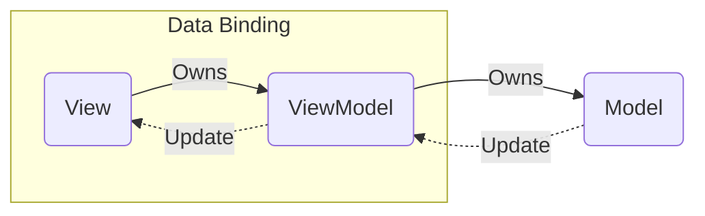
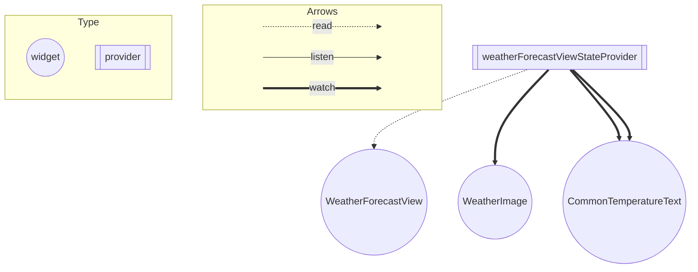

# ARCHITECTURE.md
## アーキテクチャ
本プロジェクトはMVVMを採用しています。

```mermaid
flowchart LR
    subgraph Data Binding
    id1(View) -- Owns --> id2(ViewModel) -. Update .-> id1
    end
    id2 -- Owns -->  id3(Model) -. Update .-> id2
```

## Riverpod の Provider の依存関係図

```mermaid
flowchart TB
  subgraph Arrows
    direction LR
    start1[ ] -..->|read| stop1[ ]
    style start1 height:0px;
    style stop1 height:0px;
    start2[ ] --->|listen| stop2[ ]
    style start2 height:0px;
    style stop2 height:0px;
    start3[ ] ===>|watch| stop3[ ]
    style start3 height:0px;
    style stop3 height:0px;
  end
  subgraph Type
    direction TB
    ConsumerWidget((widget));
    Provider[[provider]];
  end

  weatherForecastViewStateProvider[["weatherForecastViewStateProvider"]];
  WeatherForecastView((WeatherForecastView));
  WeatherImage((WeatherImage));
  CommonTemperatureText((CommonTemperatureText));

  weatherForecastViewStateProvider -.-> WeatherForecastView;
  weatherForecastViewStateProvider ==> WeatherImage;
  weatherForecastViewStateProvider ==> CommonTemperatureText;
  weatherForecastViewStateProvider ==> CommonTemperatureText;
```