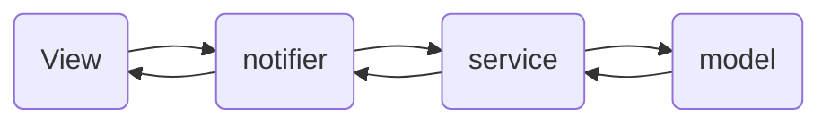
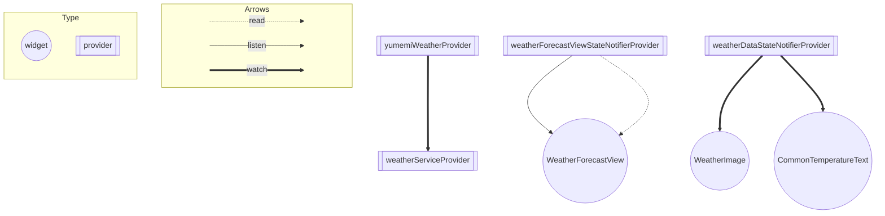

# ARCHITECTURE.md
## アーキテクチャ

### model
- レスポンスデータの最高気温、最低気温、および天気の状態（晴れ、曇り、雨など）を保持
- 天気情報をリクエストするためのデータ（エリア、日時）を保持
### service
- ビジネスロジックを含むサービス層で、外部サービスとの通信を行う
- リクエストを外部サービスに送信し、レスポンスを受け取り、適切な形式に変換
### notifier
- viewで扱う状態を管理
    - 天気情報を取得し、状態を更新
### view
- ユーザーに向けて表示されるインターフェースを構築
- view内のアクションに応じて、notifierを介してデータを取得しviewに反映

## Riverpod の Provider の依存関係図
